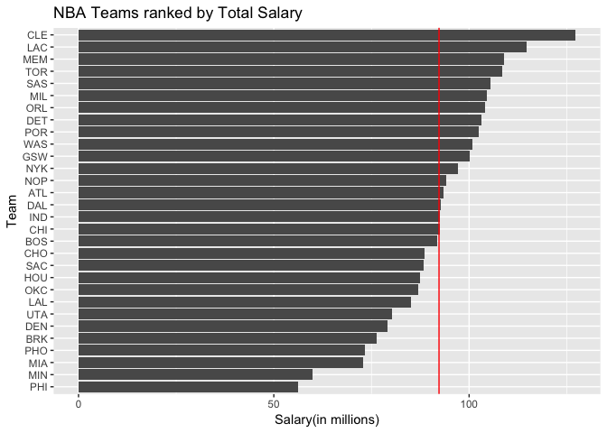
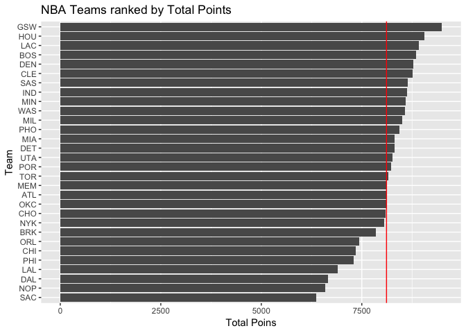
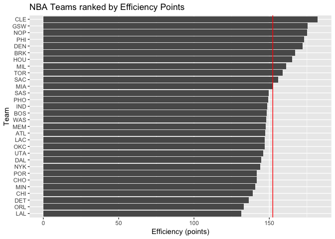
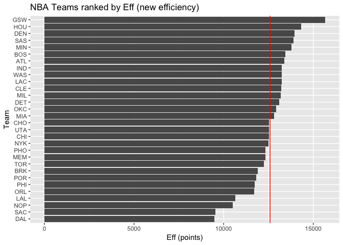

workout01-Hannah-Qiu
================
Hannah Qiu
10/4/2018

### Ranking of Teams

``` r
knitr::opts_chunk$set(echo = TRUE, fig.path = "../report/")
library(ggplot2)
library(readr)
```

``` r
teams = read_csv('../data/nba2018-teams.csv')
```

    ## Parsed with column specification:
    ## cols(
    ##   team = col_character(),
    ##   experience = col_integer(),
    ##   salary = col_double(),
    ##   points3 = col_integer(),
    ##   points2 = col_integer(),
    ##   points1 = col_integer(),
    ##   points = col_integer(),
    ##   off_rebounds = col_integer(),
    ##   def_rebounds = col_integer(),
    ##   assists = col_integer(),
    ##   steals = col_integer(),
    ##   blocks = col_integer(),
    ##   turnovers = col_integer(),
    ##   fouls = col_integer(),
    ##   efficiency = col_double()
    ## )

``` r
avg_salary <- mean(teams$salary)
by_salary <- ggplot(teams, aes(x = reorder(team, salary), y = salary )) +
  geom_bar(stat='identity') +
  coord_flip() 

by_salary <- by_salary + 
  geom_hline(aes(yintercept = avg_salary), colour="red")

by_salary + xlab("Team") + ylab("Salary(in millions)") + labs(title = "NBA Teams ranked by Total Salary")
```



``` r
avg_ttlpts = mean(teams$points)
by_points = ggplot(teams, aes(x = reorder(team, points), y = points)) + 
  geom_bar(stat = "identity") + 
  coord_flip()

by_points <- by_points + 
  geom_hline(aes(yintercept = avg_ttlpts), colour="red")

by_points + xlab("Team") + ylab("Total Poins") + labs(title = "NBA Teams ranked by Total Points")
```



``` r
avg_efficiency = mean(teams$efficiency)
by_efficiency = ggplot(teams, aes(x= reorder(team, efficiency), y = efficiency)) +
  geom_bar(stat = "identity") +
  coord_flip()

by_efficiency = by_efficiency +
  geom_hline(yintercept = avg_efficiency, col = "red")

by_efficiency + xlab("Team") + ylab("Efficiency (points)") + labs(title = "NBA Teams ranked by Efficiency Points")
```



**I would use the following pattern for the new index since factors such as experience, salary should not be used towards evaluating a player in terms of his efficiency. Moreover, important factors such as pointt3, points2, steals, etc worth more than factors like points1. Also, more fouls will cause losing more points in this new index scale.**

> eff = points3 \* 3
> + points2 \* 2
> + points1
> + off\_rebound   + def\_rebound \* 2
> + assists \* 1.5
> + steals \* 2
> + blocks
> + turnovers
> - fouls \* 2

``` r
library(dplyr)
```

    ## 
    ## Attaching package: 'dplyr'

    ## The following objects are masked from 'package:stats':
    ## 
    ##     filter, lag

    ## The following objects are masked from 'package:base':
    ## 
    ##     intersect, setdiff, setequal, union

``` r
teams = mutate(teams, eff = points3 * 3 + points2 * 2 +
         points1 + off_rebounds + def_rebounds * 2 + assists * 1.5
       + steals * 2 + blocks + turnovers - fouls * 2)
```

``` r
avg_eff = mean(teams$eff)

by_eff <- ggplot(teams, aes(x = reorder(team, eff), y = eff )) +
  geom_bar(stat='identity') +
  coord_flip() 

by_eff <- by_eff + 
  geom_hline(aes(yintercept = avg_eff), colour="red")

by_eff + xlab("Team") + ylab("Eff (points)") + labs(title = "NBA Teams ranked by Eff (new efficiency)")
```



### Comments and Reflections

-   Was this your first time working on a project with such file structure? If yes, how do you feel about it?
    Yes. It took me some time to figure out how the git and Github work with each other. But other than that, everything was not that time-consuming.
-   Was this your first time using relative paths? If yes, can you tell why they are important for reproducibility purposes?
    No. In previous assignments, I've used relative paths.
-   Was this your first time using an R script? If yes, what do you think about just writing code (without markdown syntax)?
    Yes. Better than rmd because I don't have to worry if my file will turn out looking good/organized or not since everything is code and \#\#comments.
-   What things were hard, even though you saw them in class/lab?
    Creating the teams data frame and graphing were a bit hard.
-   What was easy(-ish) even though we haven’t done it in class/lab?
    Things we've done in lab06 and also in this workout were easy.
-   Did anyone help you completing the assignment? If so, who?
    Yes. My friend who's also taking this course. And Google.
-   How much time did it take to complete this HW?
    6-7 hours.
-   What was the most time consuming part?
    Graphing the first plot, creating data frame, and dealing with Github.
-   Was there anything interesting?
    This assigment is due the same day as the midterm.
